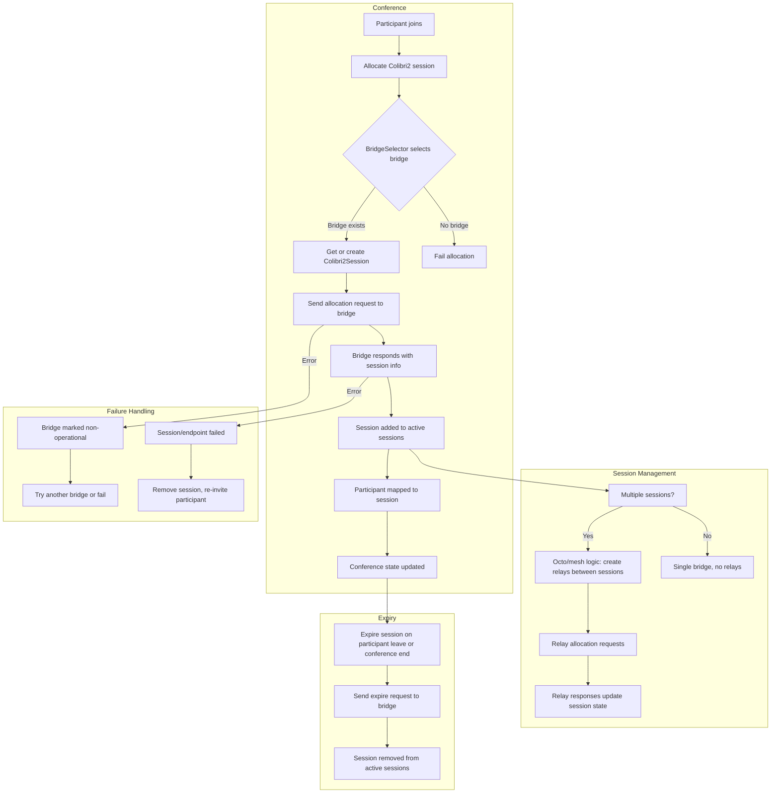

# Colibri2 Session Management: High-Level Flow

---

## Explanatory Flow

### Conference Flow
- **Participant joins**
- **Allocate Colibri2 session**
- **BridgeSelector selects a bridge**
  - If a bridge is available: get or create a Colibri2Session
  - If no bridge: fail allocation
- **Send allocation request to bridge**
- **Bridge responds with session info**
- **Session is added to active sessions**
- **Participant is mapped to the session**
- **Conference state is updated**

### Session Management
- If multiple sessions exist (multi-bridge/Octo): create relays between sessions (mesh logic)
- Relay allocation requests are sent
- Relay responses update session state

### Failure Handling
- If allocation request errors: bridge is marked non-operational, try another bridge or fail
- If bridge/session/endpoint fails: remove session, re-invite participant

### Expiry
- On participant leave or conference end: expire session
- Send expire request to bridge
- Session is removed from active sessions 